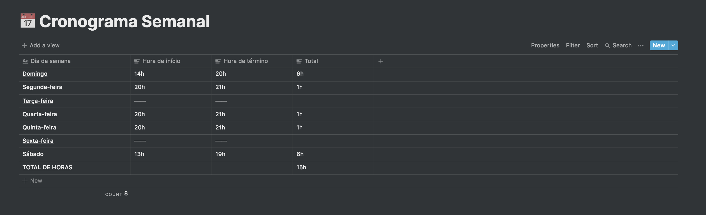
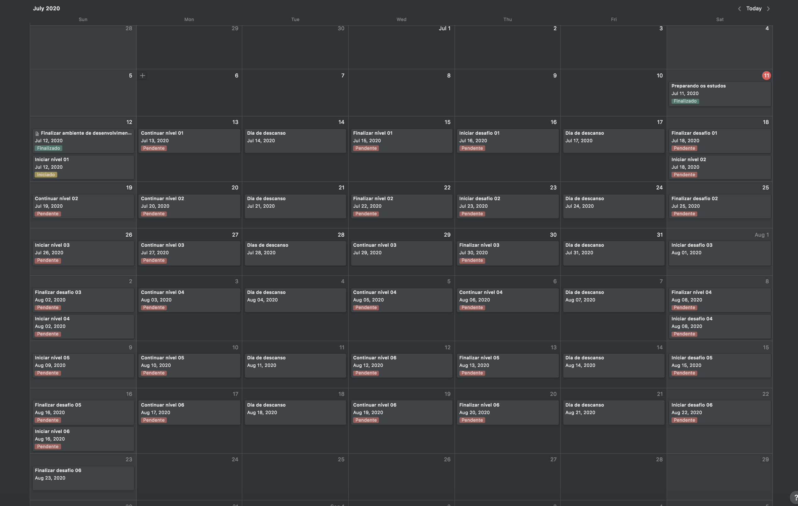

# Desafio 01 - Cronograma

## Cronograma semanal

Nesse cronograma detalho informações de quantas horas irei dedicar ao estudo do bootcamp a cada dia
da semana.

## Cronograma de conteúdo

Aqui disponibilizo em formato de calendário quando pretendo iniciar um estudo, continuar estudando
e finalizar um estudo. Tento prever também os desafio ao longo do bootcamp.

Fiz a separação por níveis conforme existe dentro da plataforma: Nível 01, Nível 02 e assim por diante.

